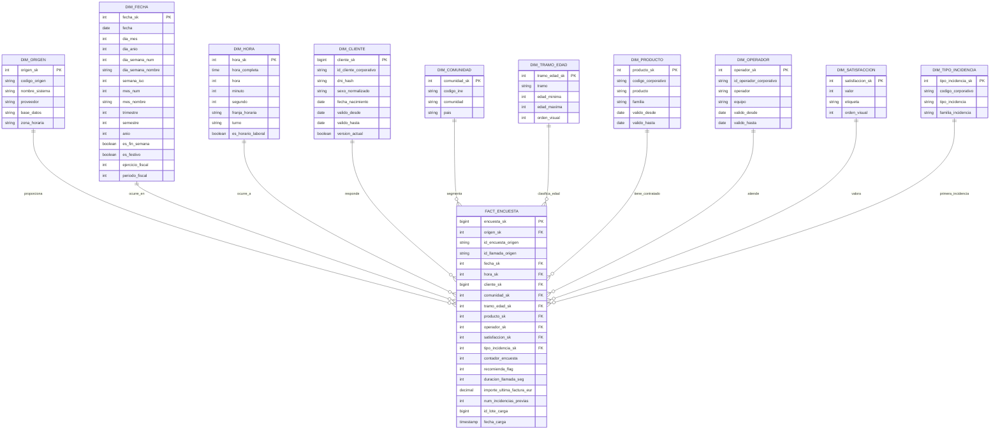

# Día 6 · Del sistema operacional al modelo BI

> Notas de preparación para una sesión de 4 horas.
>
> El fichero `encuestas-callcenter.csv` no es hoy una hoja de cálculo que haya que
> trabajar ni la fuente literal del sistema. Es una muestra didáctica del tipo de
> desorden que puede aparecer al integrar filas de dos bases operacionales. Tenemos
> libertad para imaginar una arquitectura razonable. Los tipos estadísticos ya se
> estudiaron ayer.
> Hoy toca la parte informática: fuentes, identificadores, extracción incremental,
> *staging*, reglas ETL, modelo dimensional, cargas y controles.

---

# La idea que debe quedar hoy

```
EL CSV NO ES EL SISTEMA DE INFORMACIÓN.

Es una foto plana que alguien ha obtenido juntando datos que viven en varios sitios.
```

Un proyecto BI no consiste en abrir esa foto y corregir celdas. Consiste en construir
un proceso que, cada noche o cada hora:

1. Sepa qué datos nuevos o modificados tiene que traer.
2. Los extraiga sin afectar a los sistemas operacionales.
3. Conserve una copia fiel de lo recibido.
4. Integre identificadores y formatos distintos.
5. Aplique reglas de negocio siempre de la misma manera.
6. Cargue un modelo preparado para analizar.
7. Compruebe que no ha perdido ni duplicado registros.
8. Pueda repetirse después de un fallo sin estropear nada.

La frase para repetir durante la sesión:

> Una ETL no es una limpieza que se hace una vez. Es un proceso industrial que debe
> producir el mismo resultado correcto cada vez que se ejecuta.

---

# Plan de las cuatro horas

| Tiempo | Bloque | Resultado |
|---|---|---|
| 00:00–00:15 | Volver al caso | Entender que el CSV representa una extracción |
| 00:15–00:45 | Imaginar los dos sistemas operacionales | Entender que ambos aportan filas con códigos propios |
| 00:45–01:30 | Diseñar el modelo BI | Fijar grano, hechos, dimensiones y claves |
| 01:30–01:45 | Descanso | |
| 01:45–02:30 | Extraer: cargas completas e incrementales | Entender `id`, *watermarks* y `updated_at` |
| 02:30–03:20 | Perfilar, transformar e integrar | Convertir las frecuencias de la muestra en reglas ETL |
| 03:20–03:50 | Cargar, reintentar y controlar | Idempotencia, lotes, rechazos y cuadre |
| 03:50–04:00 | Cierre | Reconstruir el recorrido completo |

Si se pierde tiempo al principio, se puede abreviar la discusión sobre dimensiones
lentamente cambiantes. No conviene recortar el bloque de incrementalidad ni el caso
de reejecución tras un fallo.

---

# 1. Volvemos al fichero de ayer

El fichero tiene 1.214 filas y 15 columnas. Representa encuestas realizadas durante
dos años.

```
id_encuesta
dni
fecha_llamada
hora_llamada
comunidad
edad
sexo
producto_contratado
importe_ultima_factura
satisfaccion_1_10
recomendaria
num_incidencias_previas
tipo_primera_incidencia
duracion_llamada_seg
operador
```

## Preguntas para abrir la clase

> ¿Creéis que una aplicación real guardaría estas quince columnas juntas en una
> única tabla?

> ¿Y si las 1.214 filas proceden de dos aplicaciones distintas que hacen lo mismo,
> cómo sabríamos de cuál vino cada fila?

No debería. Mezclan al menos cinco procesos distintos:

- Gestión de clientes.
- Contratación de productos.
- Facturación.
- Gestión de incidencias.
- Llamadas y encuestas del call center.

En nuestra hipótesis, cada una de las dos aplicaciones aporta filas completas. Aun
así, dentro de cada origen algunas columnas pueden proceder de tablas distintas o
ser cálculos hechos al preparar la extracción:

- `edad` debería salir de la fecha de nacimiento y la fecha de la llamada.
- `importe_ultima_factura` exige localizar la última factura anterior a la llamada.
- `num_incidencias_previas` exige contar incidencias anteriores a la llamada.
- `tipo_primera_incidencia` exige localizar la primera incidencia anterior.

Ésta es la primera idea nueva de hoy:

> Para integrar no basta con saber qué tablas unir. También hay que decidir **en qué
> momento del tiempo** se deben unir.

Usar la factura actual, el contrato actual o la comunidad actual del cliente para
explicar una encuesta de hace un año puede reescribir la historia.

---

# 2. Hipótesis didáctica: dos bases de datos que aportan filas

El CSV no demuestra cómo eran los sistemas originales; sólo nos inspira problemas
realistas. Para la sesión adoptamos una hipótesis deliberada: **las dos BBDD
contienen el mismo proceso de negocio y aportan filas**, no bloques de columnas.

Puede tratarse, por ejemplo, de:

- Dos call centers contratados a proveedores distintos.
- Dos compañías que se han fusionado.
- Dos aplicaciones regionales que todavía no se han unificado.
- Una plataforma antigua y su sustituta, activas a la vez durante una migración.

Cada una guarda clientes, llamadas, productos, incidencias y encuestas, pero usa sus
propios nombres, IDs, catálogos, tipos y formatos.

## BBDD A · Aplicación histórica

```
A.CLIENTE
---------
id_cliente              PK
dni
fecha_nacimiento
sexo_codigo              H / M
comunidad_codigo         MAD / CAT / AND / CLM / VAL
updated_at

A.PRODUCTO
----------
id_producto             PK
nombre_producto
updated_at

A.LLAMADA
---------
id_llamada              PK
id_cliente              FK
id_producto             FK
id_operador             FK
inicio_llamada          TIMESTAMP
duracion_segundos
importe_factura_centimos
num_incidencias_previas
tipo_primera_incidencia_codigo
updated_at

A.ENCUESTA
----------
id_encuesta             PK
id_llamada              FK
satisfaccion_codigo      1 ... 10
recomendaria_codigo      S / N
updated_at
```

## BBDD B · Plataforma del segundo proveedor

```
B.CUSTOMER
----------
customer_id             PK
document_number
birth_date
gender_code              1 / 2
region_name              texto libre
last_modified

B.SERVICE
---------
service_id              PK
service_name
last_modified

B.CONTACT
---------
contact_id              PK
customer_id             FK
service_id              FK
agent_id                FK
contact_date            DATE
contact_time            TIME
duration_seconds
last_invoice_amount      DECIMAL en euros
previous_cases
first_case_type_text
last_modified

B.SURVEY
--------
survey_id               PK
contact_id              FK
satisfaction             1 ... 10
would_recommend           Sí / No
last_modified
```

Las dos BBDD producen filas con el mismo significado de negocio, pero no con la
misma representación informática.

## El campo que no debe faltar en una integración real: el origen

Si al consolidar se hiciera algo equivalente a esto:

```sql
SELECT id_encuesta, dni, fecha_llamada, ... FROM origen_a
UNION ALL
SELECT survey_id, document_number, contact_date, ... FROM origen_b;
```

perderíamos la procedencia. Lo correcto es añadir el sistema:

```sql
SELECT 'A' AS sistema_origen, id_encuesta AS id_origen, ... FROM origen_a
UNION ALL
SELECT 'B' AS sistema_origen, survey_id   AS id_origen, ... FROM origen_b;
```

`UNION ALL` conserva todas las filas. Un `UNION` simple intentaría eliminar filas
idénticas, consumiría más recursos y podría ocultar duplicados que necesitamos
investigar.

Sin `sistema_origen` ya no podemos asegurar si:

- `M` significa mujer en un sistema o masculino en otro.
- `09/05/2026` usa calendario español o americano.
- `15460` son euros o céntimos.
- Los IDs de dos bases distintas pertenecen al mismo registro.

La clave de trazabilidad no es sólo el ID:

```
(sistema_origen, tabla_origen, id_origen)
```

Dos BBDD pueden tener perfectamente una encuesta con `id_encuesta = 10025`. En el
almacén son dos eventos distintos porque su sistema de origen es distinto.

## Tablas de mapeo gobernadas

Las diferencias no se resuelven con una larga colección de `IF` dispersos por la
ETL. Se documentan en tablas:

```
MAP_SEXO
--------
sistema_origen
codigo_origen
sexo_sk_bi
valido_desde
valido_hasta

MAP_COMUNIDAD
-------------
sistema_origen
valor_origen
comunidad_sk_bi
valido_desde
valido_hasta

MAP_PRODUCTO
------------
sistema_origen
id_producto_origen
producto_sk_bi
valido_desde
valido_hasta
```

Ejemplo:

| Origen | Código recibido | Valor común BI |
|---|---|---|
| A | `H` | Hombre |
| A | `M` | Mujer |
| B | `1` | Hombre |
| B | `2` | Mujer |

La muestra didáctica contiene más variantes que las que explicarían dos sistemas
perfectamente estables. Eso permite introducir **deriva del dato**: una versión
nueva, una carga manual o una aplicación mal validada puede crear códigos nuevos
dentro del mismo origen. Por eso las tablas de mapeo también llevan vigencia.

## Un segundo tipo de integración: unir dentro de cada origen

Aunque ambas BBDD aporten filas, dentro de cada una seguimos necesitando unir
cliente, llamada, producto y encuesta. Un cliente puede tener varios productos o
varias incidencias. Si se hace un `JOIN` sin definir el grano, las filas se
multiplican:

```
1 encuesta × 2 productos × 3 incidencias = 6 filas
```

Primero se obtiene **una fila por encuesta en cada origen**. Después se normalizan
las codificaciones. Finalmente se apilan las filas de A y B con `UNION ALL`.

La secuencia correcta:

```
BBDD A ── JOIN controlado ──► 1 fila/encuesta A ── normalizar A ──┐
                                                                    ├─► MODELO BI
BBDD B ── JOIN controlado ──► 1 fila/encuesta B ── normalizar B ──┘
```

---

# 3. Diseñamos primero el destino: el modelo BI

Antes de programar la ETL hay que saber qué modelo debe alimentar.

## El grano

La frase que define el modelo:

> Una fila de `FACT_ENCUESTA` representa una encuesta contestada al terminar una
> llamada.

Todo campo de la tabla de hechos tiene que poder explicarse para **esa encuesta**.

Preguntas de comprobación:

- ¿Puede una llamada no tener encuesta? Sí. No aparecerá en este hecho.
- ¿Puede una llamada tener dos encuestas? En principio no; debe existir una
  restricción o una regla para decidir cuál vale.
- ¿Puede un cliente aparecer varias veces? Sí, si contestó varias encuestas.
- ¿Dos filas con el mismo DNI son duplicadas? No necesariamente.
- ¿Dos encuestas con ID distinto, mismo cliente, fecha, hora y respuestas son
  duplicadas? Son sospechosas, pero necesitamos `id_llamada` o una regla de negocio.

En la muestra hay 1.214 `id_encuesta` distintos, pero sólo 1.200 DNI distintos.
Eso **no demuestra por sí solo** que haya catorce duplicados: podría haber clientes
encuestados dos veces. En este conjunto concreto hay catorce filas repetidas con
otro ID, pero en un sistema real no se deberían borrar sólo por repetir el DNI.

## Modelo en estrella

El modelo incluye una dimensión de origen porque las filas llegan de dos BBDD. La
clave funcional del hecho es `(origen_sk, id_encuesta_origen)`: el ID por sí solo no
tiene por qué ser único fuera de su sistema.



### La dimensión Fecha extendida

Se genera de antemano y contiene una fila por día. No depende de que haya encuestas.
Permite agrupar siempre de la misma forma por día, semana ISO, mes, trimestre,
semestre, año, calendario fiscal, fin de semana o festivo.

La clave suele ser un entero legible:

```
20260825  → 25 de agosto de 2026
```

### La dimensión Hora extendida

Puede tener una fila por segundo —86.400 filas— o por minuto —1.440 filas— si la
precisión del origen no llega al segundo. Incluye hora, minuto, segundo, franja,
turno y si está dentro del horario laboral.

Separar Fecha y Hora evita una dimensión con una fila por cada segundo de todos los
años y permite reutilizar ambas en otros hechos.

### `FACT_ENCUESTA`

```
encuesta_sk                 PK técnica del almacén
origen_sk                   FK
id_encuesta_origen          identificador que llega del origen
id_llamada_origen           identificador de trazabilidad
fecha_sk                    FK
hora_sk                     FK
cliente_sk                  FK
comunidad_sk                FK
tramo_edad_sk               FK
producto_sk                 FK
operador_sk                 FK
satisfaccion_sk             FK
tipo_incidencia_sk          FK

contador_encuesta           siempre 1
recomienda_flag             1, 0 o desconocido
duracion_llamada_seg
importe_ultima_factura_eur
num_incidencias_previas

id_lote_carga
fecha_carga
```

### ¿Por qué `satisfaccion` aparece como dimensión?

Porque ya vimos que es ordinal. La pregunta útil es cuántas encuestas hay en cada
nivel y cómo se distribuyen. Si se trata sin cuidado como medida, alguien terminará
sumándola o promediándola.

```
DIM_SATISFACCION
----------------
satisfaccion_sk
valor                 1 ... 10
etiqueta               muy baja, baja, media, alta...
orden_visual
```

### Valores desconocidos y no aplicables

No se dejan claves foráneas a `NULL` sin explicación. Reservamos miembros técnicos:

```
-1  DESCONOCIDO / NO INFORMADO
-2  NO APLICA
```

En `tipo_primera_incidencia` es esencial:

- Cliente con 0 incidencias → `-2 NO APLICA`.
- Cliente con incidencias pero tipo ausente → `-1 DESCONOCIDO`.

Así se conserva la diferencia estudiada ayer.

### ¿Una tabla de hechos o dos?

Para el ejercicio usamos una sola: `FACT_ENCUESTA`.

En un proyecto más completo separaríamos:

- `FACT_LLAMADA`: todas las llamadas, tengan o no encuesta.
- `FACT_ENCUESTA`: sólo respuestas.

Si se mete todo en `FACT_ENCUESTA`, nunca podremos medir el porcentaje de llamadas
que termina con encuesta, porque las llamadas sin encuesta han desaparecido.

## Métricas que requieren cuidado

- `contador_encuesta` sí se suma.
- `duracion_llamada_seg` se puede sumar para carga de trabajo y resumir con
  percentiles o medias según el propósito.
- `recomienda_flag` puede sumarse como numerador y dividirse por respuestas
  conocidas.
- `importe_ultima_factura_eur` es una fotografía asociada al cliente y a la llamada.
  Sumarlo entre encuestas puede contar varias veces la misma factura.
- `num_incidencias_previas` tampoco se suma entre encuestas del mismo cliente.

## Dimensiones lentamente cambiantes

No hace falta profundizar si no hay tiempo, pero sí plantear la pregunta:

> Si un cliente vivía en Madrid cuando respondió y hoy vive en Valencia, ¿dónde debe
> aparecer aquella encuesta?

- Tipo 1: se sobrescribe el valor. Toda la historia aparece con Valencia.
- Tipo 2: se crea una nueva versión del cliente. La encuesta antigua sigue en Madrid.

Para análisis histórico, normalmente queremos el valor válido en el momento de la
llamada.

---

# 4. Arquitectura del proceso ETL

```
┌─────────────────┐        ┌─────────────────┐
│ BBDD A          │        │ BBDD B          │
│ clientes        │        │ customers       │
│ llamadas        │        │ contacts        │
│ productos       │        │ services        │
│ encuestas       │        │ surveys         │
└────────┬────────┘        └────────┬────────┘
         └──────────┬───────────────┘
                    ▼
             STAGING RAW / BRONZE
          copia fiel + datos de auditoría
                    │
                    ▼
            INTEGRACIÓN / SILVER
       tipos, catálogos, cruces y reglas
                    │
                    ▼
            MODELO BI / GOLD
          dimensiones + tabla de hechos
                    │
                    ▼
          MODELO SEMÁNTICO / INFORMES
```

Los nombres *bronze/silver/gold* son modernos; *staging/integración/presentación*
expresan la misma separación lógica.

## Por qué conservar una copia RAW

La capa RAW no corrige nada. Añade sólo metadatos:

```
sistema_origen
tabla_origen
id_lote
fecha_extraccion
id_registro_origen
payload o columnas originales
```

Sirve para:

- Repetir las transformaciones sin volver a molestar al origen.
- Demostrar qué llegó realmente.
- Investigar errores.
- Aplicar una regla nueva al histórico.
- Separar «el origen envió esto» de «nosotros lo interpretamos así».

---

# 5. ¿Cómo sabemos hasta dónde hemos traído?

Éste es uno de los puntos centrales de la sesión.

## Primera carga: carga completa

La primera vez no tenemos nada. Extraemos todo lo necesario:

```sql
SELECT * FROM A.ENCUESTA;
SELECT * FROM B.SURVEY;
```

Esto puede valer para una tabla pequeña. Repetirlo cada noche sobre millones de
filas es lento, consume red y castiga producción.

## Carga incremental por ID

Si las tablas de encuesta son eventos que sólo reciben inserciones y sus IDs son
crecientes, cada origen lleva su propio punto de lectura:

```sql
SELECT *
FROM A.ENCUESTA
WHERE id_encuesta > :ultimo_id_cargado
ORDER BY id_encuesta;

SELECT *
FROM B.SURVEY
WHERE survey_id > :ultimo_id_cargado_b
ORDER BY survey_id;
```

Se guarda el último ID procesado en una tabla de control:

```
ETL_CONTROL
-----------
sistema_origen
tabla_origen
campo_watermark
ultimo_timestamp
ultimo_id
ultimo_lote_correcto
fecha_ultima_carga_correcta
```

Ejemplo:

| sistema | tabla | campo | último ID | último lote correcto |
|---|---|---|---:|---:|
| A | ENCUESTA | `id_encuesta` | 10.600 | 428 |
| B | SURVEY | `survey_id` | 8.245 | 428 |

Aunque ambos últimos ID coincidieran, seguirían siendo dos controles distintos.
Cada origen puede avanzar a una velocidad diferente o estar caído durante un lote.

### Regla importante: los huecos en los ID no importan

```
10600, 10601, 10604, 10609...
```

No se compara el número de filas con el ID. Los huecos pueden proceder de
transacciones anuladas o secuencias compartidas. Lo que se conserva es el máximo
ID cargado correctamente.

## Fijar un límite al comenzar el lote

Mientras extraemos pueden seguir entrando encuestas. Para que el lote tenga un final
estable, primero capturamos el máximo:

```sql
SELECT MAX(id_encuesta) AS id_hasta
FROM A.ENCUESTA;
```

Después:

```sql
SELECT *
FROM A.ENCUESTA
WHERE id_encuesta > :id_desde
  AND id_encuesta <= :id_hasta
ORDER BY id_encuesta;
```

El siguiente lote empezará después de `id_hasta`.

## El ID no siempre basta

Funciona bien para eventos inmutables: nuevas llamadas o nuevas encuestas.

No funciona para una tabla como `CLIENTE`:

```
id_cliente = 320 se cargó hace seis meses.
Hoy cambia de comunidad.
Su ID sigue siendo 320.
```

Una consulta `id_cliente > ultimo_id` nunca verá la modificación.

Opciones:

1. Columna `updated_at` mantenida por el sistema de origen.
2. CDC (*Change Data Capture*), que lee el registro de cambios de la base de datos.
3. Marca de versión o número de secuencia.
4. Comparación completa mediante hash, si no existe otra cosa y el volumen lo permite.

## Watermark compuesto: `updated_at` + `id`

Usar sólo el timestamp también tiene un borde peligroso: varios registros pueden
tener exactamente la misma hora de modificación. Se usa un orden estable con dos
campos:

```sql
SELECT *
FROM A.CLIENTE
WHERE updated_at > :ultimo_timestamp
   OR (updated_at = :ultimo_timestamp AND id_cliente > :ultimo_id)
ORDER BY updated_at, id_cliente;
```

El *watermark* que se guarda es la pareja:

```
(2026-08-25 18:04:12.381, 8452)
```

## ¿Y los borrados?

Ni `id > último_id` ni `updated_at` detectan una fila que ya no existe.

Hace falta una de estas soluciones:

- Borrado lógico: `deleted_at` o `activo = 0`.
- CDC con eventos de borrado.
- Comparación periódica completa.
- Aceptar formalmente que el almacén conserva historia aunque el origen borre.

No es una decisión puramente técnica. Depende de qué significa el borrado y de las
obligaciones de conservación y privacidad.

---

# 6. Lotes, fallos e idempotencia

## Tabla de ejecución

Cada intento de carga crea un lote:

```
ETL_LOTE
--------
id_lote
proceso
fecha_inicio
fecha_fin
estado                   INICIADO / CORRECTO / ERROR
watermark_desde
watermark_hasta
filas_extraidas
filas_insertadas
filas_actualizadas
filas_rechazadas
mensaje_error
```

## Ejercicio de la carga que falla

Estado inicial:

```
último id correcto = 10.600
máximo al comenzar = 10.850
```

El proceso extrae de 10.601 a 10.850. Cuando iba por 10.720, falla.

Preguntas:

1. ¿Guardamos 10.720 como último ID correcto? **No.**
2. ¿Desde dónde empieza el siguiente intento? Desde 10.601.
3. ¿No volverá a leer registros ya leídos? Sí, y debe poder hacerlo sin duplicar.
4. ¿Cuándo se cambia el *watermark* a 10.850? Sólo después de terminar y validar la
   carga completa.

La propiedad que buscamos se llama **idempotencia**:

> Ejecutar dos veces el mismo lote produce el mismo estado final que ejecutarlo una
> vez.

Se consigue con varias defensas:

- Clave única `(sistema_origen, id_encuesta_origen)` en la tabla de hechos.
- `MERGE` o *upsert* en lugar de insertar sin comprobar.
- Zona RAW identificada por origen, clave y lote.
- Actualización del *watermark* dentro de la misma transacción lógica que confirma
  el éxito.
- Posibilidad de borrar y reconstruir un lote de la capa intermedia.

Ejemplo conceptual:

```sql
MERGE INTO fact_encuesta destino
USING encuesta_preparada origen
   ON destino.origen_sk = origen.origen_sk
  AND destino.id_encuesta_origen = origen.id_encuesta_origen
WHEN MATCHED THEN UPDATE SET ...
WHEN NOT MATCHED THEN INSERT (...);
```

## Llegadas tardías

Una encuesta de ayer puede llegar hoy porque un sistema estuvo desconectado. Su
fecha de negocio es ayer, pero su fecha de carga es hoy.

Por eso conviven:

```
fecha_evento      cuándo ocurrió la llamada
fecha_extraccion  cuándo la vimos en el origen
fecha_carga       cuándo entró al almacén
```

No se debe usar `fecha_llamada > última_fecha_llamada` como único incremental: un
registro atrasado podría quedar fuera para siempre.

---

# 7. Tabla de frecuencias y reglas ETL

La muestra permite pasar de una frase vaga —«vienen datos desordenados de dos
BBDD»— a problemas observables. No estamos intentando deducir cómo eran realmente
esas BBDD: usamos las frecuencias para decidir qué conflictos queremos representar
en nuestra arquitectura imaginada.

Para identificadores y variables continuas no aporta nada imprimir cientos de
valores. En esos casos se usa la frecuencia de repetición, el formato o intervalos.

## Perfil general de las quince columnas

| Columna | Vacíos | Valores distintos no vacíos | Lectura inicial |
|---|---:|---:|---|
| `id_encuesta` | 0 | 1.214 | Todos distintos |
| `dni` | 0 | 1.200 | Hay 14 valores repetidos |
| `fecha_llamada` | 0 | 865 | Varias llamadas por fecha y formatos mezclados |
| `hora_llamada` | 0 | 644 | Valores entre las 08:00 y las 21:59 |
| `comunidad` | 0 | 24 | Sólo representan 5 comunidades reales |
| `edad` | 43 | 75 | Hay valores imposibles |
| `sexo` | 0 | 8 | Representan 2 categorías |
| `producto_contratado` | 0 | 10 | Representan 5 productos |
| `importe_ultima_factura` | 90 | 1.096 | Casi todos distintos; formatos y unidades mezclados |
| `satisfaccion_1_10` | 200 | 10 | Escala completa, con muchos no informados |
| `recomendaria` | 123 | 8 | Representan sí/no con varias codificaciones |
| `num_incidencias_previas` | 109 | 5 | Valores 0–4 más desconocido |
| `tipo_primera_incidencia` | 631 | 7 | El vacío mezcla no aplica y no informado |
| `duracion_llamada_seg` | 0 | 612 | Continua, con extremos claros |
| `operador` | 0 | 7 | Representan 6 personas |

## `id_encuesta` y `dni`

| Frecuencia de aparición | IDs de encuesta con esa frecuencia | DNI con esa frecuencia |
|---:|---:|---:|
| 1 | 1.214 | 1.186 |
| 2 | 0 | 14 |

Los 1.214 IDs son únicos. Hay catorce DNI que aparecen dos veces. Si ignoramos sólo
`id_encuesta`, aparecen además catorce parejas con el resto del contenido idéntico.
Son duplicados plantados en la muestra, pero la regla general sigue siendo:

> Dos filas con el mismo DNI no son automáticamente duplicadas. El identificador
> fiable del evento debe ser `(sistema_origen, id_encuesta_origen)` y, si existe,
> también se conserva `id_llamada_origen`.

## `fecha_llamada`

| Forma observada | Frecuencia | Problema |
|---|---:|---|
| `YYYY-MM-DD` | 317 | Formato ISO, no ambiguo |
| `DD-MM-YY` | 186 | Año con dos dígitos |
| Con `/`, seguro `DD/MM/YYYY` porque el primer número supera 12 | 349 | Interpretable |
| Con `/`, seguro `MM/DD/YYYY` porque el segundo número supera 12 | 25 | Formato americano |
| Con `/`, ambos números son 12 o menores | 337 | Sintácticamente ambiguo |

De las 337 cadenas ambiguas, 19 tienen el mismo número para mes y día; en las otras
**318** las dos interpretaciones producen fechas distintas. La ETL no puede resolver
esto mirando el valor. Necesita `sistema_origen` y el contrato de formato de cada
fuente.

## `hora_llamada`

Hay 644 horas/minutos distintos. La frecuencia por hora es:

| Hora | Filas | Hora | Filas |
|---:|---:|---:|---:|
| 08 | 84 | 15 | 82 |
| 09 | 96 | 16 | 87 |
| 10 | 94 | 17 | 101 |
| 11 | 98 | 18 | 83 |
| 12 | 96 | 19 | 68 |
| 13 | 84 | 20 | 86 |
| 14 | 87 | 21 | 68 |

No hay valores imposibles. La transformación interesante no es limpiar, sino
resolver `hora_sk` y obtener franja, turno y horario laboral desde `DIM_HORA`.

## `comunidad`

| Valor recibido | Frecuencia | Valor recibido | Frecuencia |
|---|---:|---|---:|
| `ANDALUCIA` | 60 | `Castilla la Mancha` | 59 |
| `Comunidad de Madrid` | 59 | `MADRID` | 57 |
| `Catalunya` | 57 | `andalucía` | 56 |
| `Comunidad Valenciana` | 56 | `CASTILLA LA MANCHA` | 55 |
| `C. Valenciana` | 55 | `VALENCIA` | 52 |
| `castilla la mancha` | 52 | `CATALUÑA` | 50 |
| `madrid` | 50 | `Castilla La Mancha ` | 50 |
| `Castilla-La Mancha` | 50 | `Cataluña` | 49 |
| `valencia` | 48 | `Madrid` | 48 |
| `C. Madrid` | 46 | `Andalucía` | 46 |
| `cataluña` | 43 | `C. La Mancha` | 41 |
| `CLM` | 40 | `Andalucia` | 35 |

Son 24 textos para cinco comunidades. La ETL debe resolverlos mediante
`MAP_COMUNIDAD(sistema_origen, valor_origen, comunidad_sk_bi)`, no mediante el texto
que se mostrará en el informe.

## `edad`

| Valor o intervalo | Frecuencia | Interpretación |
|---|---:|---|
| Vacío | 43 | No informado |
| −3 | 35 | Imposible |
| 0 | 32 | Imposible como edad de cliente |
| 199 | 49 | Imposible |
| 999 | 47 | Imposible |
| 18–19 | 29 | Válido |
| 20–29 | 148 | Válido |
| 30–39 | 124 | Válido |
| 40–49 | 152 | Válido |
| 50–59 | 155 | Válido |
| 60–69 | 138 | Válido |
| 70–79 | 143 | Válido |
| 80–89 | 119 | Válido |

Hay 163 edades imposibles. En el sistema imaginado sería mejor extraer
`fecha_nacimiento` y calcular la edad **en la fecha de la llamada**, para después
resolver `tramo_edad_sk`.

## `sexo`

| Valor | Frecuencia | Valor común propuesto |
|---|---:|---|
| `Hombre` | 177 | Hombre |
| `1` | 159 | Hombre según contrato del origen correspondiente |
| `2` | 154 | Mujer según contrato del origen correspondiente |
| `H` | 153 | Hombre |
| `m` | 152 | Mujer |
| `M` | 148 | Mujer |
| `Mujer` | 138 | Mujer |
| `h` | 133 | Hombre |

La interpretación de `1`, `2` o incluso `M` no se debe generalizar sin conocer el
origen. El mapa incluye siempre `sistema_origen`.

## `producto_contratado`

| Valor recibido | Frecuencia | Producto común |
|---|---:|---|
| `Fibra 600Mb` | 157 | Fibra 600 Mb |
| `FIBRA + MOVIL` | 146 | Fibra + Móvil |
| `FIBRA 600` | 130 | Fibra 600 Mb |
| `tv premium` | 125 | TV Premium |
| `TV Premium` | 122 | TV Premium |
| `Fibra+Móvil` | 119 | Fibra + Móvil |
| `Móvil 20GB` | 118 | Móvil 20 GB |
| `Fibra600` | 104 | Fibra 600 Mb |
| `MOVIL 20GB` | 103 | Móvil 20 GB |
| `Móvil 50GB` | 90 | Móvil 50 GB |

Hay diez nombres para cinco productos. Lo ideal es integrar por
`(sistema_origen, id_producto_origen)`, no por el nombre.

## `importe_ultima_factura`

| Forma observada | Frecuencia |
|---|---:|
| Coma decimal | 640 |
| Punto decimal | 279 |
| Coma y símbolo `€` | 164 |
| Entero sin unidad explícita | 41 |
| Vacío | 90 |

Si interpretamos los 41 enteros como céntimos, la distribución normalizada queda:

| Importe normalizado | Frecuencia |
|---|---:|
| Menos de 50 € | 207 |
| 50–99,99 € | 336 |
| 100–149,99 € | 325 |
| 150 € o más | 256 |
| No informado | 90 |

La regla no debe basarse en que el número «parece demasiado grande». Cada origen
debe declarar tipo, escala, unidad y moneda.

## `satisfaccion_1_10`

| Valor | Frecuencia | Valor | Frecuencia |
|---:|---:|---:|---:|
| 1 | 108 | 6 | 99 |
| 2 | 91 | 7 | 98 |
| 3 | 112 | 8 | 95 |
| 4 | 97 | 9 | 106 |
| 5 | 110 | 10 | 98 |
| Vacío | 200 | | |

Todos los valores informados están dentro de la escala. Los 200 vacíos se resuelven
contra el miembro `DESCONOCIDO` de `DIM_SATISFACCION`; no se sustituyen por cero.

## `recomendaria`

| Valor | Frecuencia | Valor común |
|---|---:|---|
| `Sí` | 150 | Sí |
| `s` | 144 | Sí |
| `NO` | 140 | No |
| `N` | 137 | No |
| `No` | 134 | No |
| `S` | 134 | Sí |
| `n` | 132 | No |
| `SI` | 120 | Sí |
| Vacío | 123 | Desconocido |

## `num_incidencias_previas`

| Valor | Frecuencia |
|---:|---:|
| 0 | 388 |
| 1 | 303 |
| 2 | 214 |
| 3 | 90 |
| 4 | 110 |
| Vacío | 109 |

El vacío es desconocido. No debe convertirse en cero.

## `tipo_primera_incidencia`

| Valor | Frecuencia | Valor común |
|---|---:|---|
| `AVERIA TECNICA` | 97 | Avería técnica |
| `Portabilidad` | 93 | Portabilidad |
| `Atención al cliente` | 93 | Atención al cliente |
| `Facturación` | 86 | Facturación |
| `Avería técnica` | 79 | Avería técnica |
| `facturacion` | 70 | Facturación |
| `Instalación` | 65 | Instalación |
| Vacío | 631 | Depende de la otra columna |

Los 631 huecos se dividen así:

| Situación | Filas | Miembro de la dimensión |
|---|---:|---|
| 0 incidencias y tipo vacío | 388 | `NO APLICA` |
| Número desconocido y tipo vacío | 109 | `DESCONOCIDO` |
| Número positivo y tipo vacío | 134 | `DESCONOCIDO` |

## `duracion_llamada_seg`

| Intervalo | Frecuencia | Lectura |
|---|---:|---|
| Menos de 30 s | 82 | Llamada cortada o sospechosa |
| 30–300 s | 362 | 0,5–5 minutos |
| 301–600 s | 373 | 5–10 minutos |
| 601–900 s | 339 | 10–15 minutos |
| 901–3.600 s | 0 | No aparecen en la muestra |
| Más de una hora | 58 | Posible llamada no colgada |

Son 612 valores distintos. Los extremos se marcan; no se eliminan automáticamente.

## `operador`

| Valor recibido | Frecuencia |
|---|---:|
| `Ana Ruiz` | 195 |
| `Menchu Rodríguez` | 189 |
| `Manuel Sánchez` | 180 |
| `Gertrudis Pérez` | 174 |
| `Menchu Rodriguez` | 170 |
| `Federico Álvarez` | 169 |
| `Luciano Gómez` | 137 |

Son siete grafías para seis personas. `Menchu Rodríguez` suma 359 filas entre sus
dos grafías. En una integración correcta se usa
`(sistema_origen, id_operador_origen)`, y el nombre queda como descripción.

## Resumen de reglas que salen del perfilado

| Problema | Regla ETL posible |
|---|---|
| Codificaciones diferentes entre fuentes | Mapas gobernados por origen y código |
| Fechas ambiguas | Contrato de formato por origen; no adivinar por el texto |
| Unidad monetaria distinta | Metadatos de unidad y moneda por origen |
| Valores imposibles | Cuarentena o desconocido con incidencia de calidad |
| Valores raros pero posibles | Cargar con bandera de anomalía |
| Vacíos con significado diferente | Miembros separados `DESCONOCIDO` y `NO APLICA` |
| IDs locales | Clave de trazabilidad compuesta con sistema de origen |
| Posibles duplicados | Regla basada en evento e ID de llamada, no sólo DNI |

## El problema de las fechas ambiguas

`09/05/2026` puede significar 9 de mayo o 5 de septiembre. Mirar el texto no basta.

La solución correcta no es probar formatos hasta que uno funcione. Es conocer el
sistema de origen:

```
CRM_ES          DD/MM/YYYY
PROVEEDOR_US    MM/DD/YYYY
CALLCENTER      TIMESTAMP nativo
```

En una base de datos bien diseñada la fecha llega como tipo fecha, no como texto.
El caos aparece muchas veces durante exportaciones, integraciones o cargas manuales.

## El problema de los importes

La BBDD de facturación debería guardar:

```
importe_centimos = 15460
moneda = EUR
```

La capa de integración calcula:

```
importe_eur = importe_centimos / 100
```

El fichero mezcla `154,60`, `154.60`, `154,60 €` y `15460`. La ETL no debería
deducir la unidad mirando si el número parece muy grande. Debe existir un contrato
de datos por origen.

## Las reglas temporales de integración

Para cada encuesta con instante `t_llamada`:

### Contrato activo

```sql
fecha_inicio <= t_llamada
AND (fecha_fin IS NULL OR fecha_fin > t_llamada)
```

Si hay varios productos activos, un `JOIN` multiplica la encuesta. Hay que decidir:

- Cargar una fila por encuesta y producto mediante una tabla puente.
- Elegir el producto principal con una regla de negocio.
- Cambiar el grano del hecho.

### Última factura conocida en ese momento

```sql
MAX(fecha_emision)
WHERE fecha_emision <= t_llamada
```

No vale la última factura que existe hoy.

### Incidencias previas

```sql
COUNT(*)
WHERE fecha_apertura < t_llamada
```

### Primera incidencia previa

```sql
MIN(fecha_apertura)
WHERE fecha_apertura < t_llamada
```

Estas reglas deben estar documentadas. Dos equipos pueden escribir SQL correcto y
obtener cifras distintas si uno usa `<` y otro `<=`, o si uno cuenta incidencias
reabiertas y otro no.

---

# 8. Orden completo de la ETL

## E · Extraer

1. Abrir un lote.
2. Leer el *watermark* del último lote correcto.
3. Fijar el límite superior de esta ejecución.
4. Extraer por separado de cada tabla de las BBDD A y B.
5. Guardar copia fiel en RAW con origen, lote y fecha de extracción.
6. Contar y registrar filas.

## T · Transformar e integrar

1. Validar que han llegado las columnas esperadas.
2. Convertir tipos informáticos.
3. Aplicar catálogos de comunidad, producto, operador, sexo y recomendación.
4. Resolver la identidad del cliente entre los dos sistemas.
5. Distinguir desconocido y no aplica.
6. Detectar imposibles y enviar a cuarentena.
7. Calcular edad en la fecha de llamada.
8. Localizar contrato activo, última factura e incidencias previas.
9. Detectar duplicados por claves de evento, no por el nombre ni por el DNI.
10. Resolver las claves técnicas de las dimensiones.

## L · Cargar

El orden importa:

```
1. Dimensiones y sus miembros desconocidos/no aplicables
2. Altas y cambios de dimensiones
3. Tabla de hechos
4. Controles de cuadre
5. Confirmación del lote
6. Avance del watermark
```

La tabla de hechos no se carga antes que las dimensiones porque necesita sus claves.

---

# 9. Registros rechazados y cuarentena

No todo error debe detener dos millones de filas. Pero tampoco se debe borrar lo que
no encaja.

```
ETL_RECHAZO
-----------
id_rechazo
id_lote
sistema_origen
tabla_origen
id_registro_origen
regla_incumplida
valor_recibido
fecha_rechazo
estado_revision
```

Ejemplos:

- Edad −3: imposible. Se conserva el registro, la edad pasa a desconocida y se crea
  una incidencia de calidad.
- Comunidad no reconocida: puede enviarse a desconocido y notificarse al dueño del
  catálogo.
- Encuesta sin `id_encuesta`: error crítico; no se puede garantizar que no se
  duplique. Probablemente se rechaza la fila completa.
- Llamada de 8.400 segundos: rara, pero posible. Se carga con una bandera de anomalía.

La regla:

> Un valor raro se marca. Un valor imposible se aísla. Ninguno se borra en silencio.

---

# 10. Controles de cierre del lote

Antes de declarar el lote correcto:

## Controles técnicos

- Filas extraídas = filas en RAW para ese origen y lote.
- Filas preparadas = insertadas + actualizadas + rechazadas justificadas.
- Ninguna clave obligatoria nula.
- Ninguna FK de hechos sin dimensión, salvo miembros técnicos `-1` y `-2`.
- No hay dos hechos con el mismo `(sistema_origen, id_encuesta_origen)`.
- El ID máximo cargado no supera el límite fijado al comienzo.

## Controles de negocio

- Número de encuestas por día dentro de rangos razonables.
- Distribución de recomendación y satisfacción comparable con días anteriores.
- Porcentaje de desconocidos no crece bruscamente.
- Importe de factura en un rango y unidad plausibles.
- No aparecen de repente 24 comunidades en lugar de 5.

## Cuadre sencillo para dibujar

```
250 extraídas
= 243 cargadas
+   4 actualizadas
+   3 rechazadas con motivo
----------------------------
250 explicadas
```

Si hay 250 de entrada y sólo podemos explicar 249, el lote no está cerrado.

---

# 11. Actividad final por grupos

## Situación

Anoche la ETL terminó correctamente con:

```
A.ENCUESTA      ultimo_id = 10600
B.SURVEY        ultimo_id = 10600
A.CLIENTE       watermark = (2026-08-24 23:00:00, 8452)
B.CUSTOMER      watermark = (2026-08-24 22:58:00, 6130)
```

Hoy ocurre lo siguiente:

1. En A entran encuestas con IDs 10601 a 10850.
2. En B entran encuestas con IDs 10601 a 10740.
3. Por tanto, ambas fuentes tienen una encuesta local con ID 10637.
4. El cliente 320 de A cambia de Madrid a Valencia.
5. Una encuesta realizada ayer llega hoy a B con ID 10739.
6. La carga de A falla después de escribir parte del lote; la de B termina bien.
7. Un cliente tiene dos productos activos en la fecha de la llamada.
8. B envía una comunidad nueva como `Com. Madrid`, que no está en su mapa.

## Preguntas

1. ¿Cuántas consultas incrementales y cuántos puntos de control hacen falta?
2. ¿Colisionan las dos encuestas con ID 10637 en el almacén?
3. ¿Por qué `id_cliente > 8452` no detecta el cambio del cliente 320?
4. ¿Qué *watermark* necesita `CLIENTE`?
5. ¿Qué fecha debe conservar la encuesta atrasada: la del evento o la de carga?
6. ¿Puede confirmarse el *watermark* de B aunque falle A?
7. ¿Cómo se evita duplicar al reintentar el lote de A?
8. ¿Qué hacemos con `Com. Madrid`?
9. ¿Qué ocurre si unimos directamente la encuesta con los dos contratos?
10. ¿Cuándo se actualiza cada fila de `ETL_CONTROL`?

## Respuestas esperadas

1. Dos consultas y dos controles independientes: uno para A y otro para B, cada uno
   con su límite superior fijado al comenzar.
2. No. La clave funcional incluye el origen: `(A, 10637)` y `(B, 10637)`.
3. Porque el registro se modificó pero conserva el mismo ID.
4. `(updated_at, id_cliente)` o CDC.
5. Las dos: fecha del evento para analizar y fecha de carga para auditar.
6. Depende de la unidad de publicación acordada. Técnicamente puede confirmarse B
   por separado; si el informe exige una fotografía conjunta de A+B, se puede
   mantener el lote global sin publicar hasta que A termine.
7. Clave única de origen, *upsert*, lote identificable y no avanzar el *watermark*
   de A hasta confirmar.
8. No inventar el mapeo silenciosamente: desconocido/cuarentena y actualización
   gobernada de `MAP_COMUNIDAD` para B.
9. La fila se duplica. Hay que elegir regla, puente o nuevo grano.
10. Al final de cada extracción/carga que haya terminado y cuadrado correctamente;
    nunca sólo porque se hayan leído algunas filas.

---

# 12. Dudas previsibles

## «¿Por qué no guardamos simplemente el último ID en un fichero?»

Podría funcionar en un prototipo. En producción necesitamos transacciones,
concurrencia, historial de ejecuciones y saber qué proceso cambió el valor. Una
tabla de control es auditable y se puede consultar junto al resto del proceso.

## «¿Por qué volver a traer una fila si ya está cargada?»

Porque puede haber cambiado. Los maestros —clientes, productos, contratos— no son
eventos inmutables. Para ellos necesitamos `updated_at`, versión o CDC.

## «¿Por qué usar ID y timestamp juntos?»

Porque muchos registros pueden compartir el mismo timestamp. El ID rompe el empate
y permite reanudar desde un punto exacto.

## «¿Y si el ID vuelve a empezar desde 1?»

Puede ocurrir por particiones, migraciones o varios orígenes. La clave real de
trazabilidad es compuesta:

```
(sistema_origen, tabla_origen, id_origen)
```

Nunca se presupone que el ID de una aplicación es único en toda la empresa.

## «¿Por qué no unir por DNI?»

Porque es un identificador de negocio y un dato personal, no una clave técnica
fiable. Puede faltar, estar duplicado, cambiar de documento o venir con errores. Se
usa como evidencia para reconciliar, no como única garantía sin controles.

## «¿Por qué no corregir el dato directamente en RAW?»

Porque perderíamos la prueba de lo que llegó. La corrección es una interpretación y
puede cambiar mañana. RAW conserva; integración interpreta.

## «¿ETL o ELT?»

La lógica es la misma. Cambia dónde se ejecuta:

- ETL: transformar antes de cargar el almacén final.
- ELT: cargar primero en la plataforma analítica y transformar dentro.

En ambos casos siguen existiendo origen, copia cruda, reglas, modelo y controles.

## «¿Una ETL puede arreglar cualquier dato?»

No. Puede estandarizar formatos y aplicar reglas conocidas. No puede adivinar si
`09/05/2026` era formato español o americano, ni decidir qué contrato era el
principal, ni inventar la satisfacción que falta. Esas decisiones necesitan
contratos de datos y responsables de negocio.

---

# 13. Cierre en la pizarra

Reconstruir entre todos el camino:

```
DOS SISTEMAS OPERACIONALES
        │
        │  ID / UPDATED_AT / CDC
        ▼
EXTRACCIÓN INCREMENTAL
        │
        │  LOTE + WATERMARK
        ▼
RAW: COPIA FIEL
        │
        │  CATÁLOGOS + REGLAS + IDENTIDADES + TIEMPO
        ▼
INTEGRACIÓN
        │
        │  CLAVES TÉCNICAS
        ▼
DIMENSIONES + FACT_ENCUESTA
        │
        │  CUADRES + RECHAZOS + AUDITORÍA
        ▼
DATOS FIABLES PARA EL CUADRO DE MANDO
```

## Las cinco ideas que tienen que llevarse

1. Antes de unir tablas se define el grano.
2. Los IDs sirven para integrar y para extraer, pero un ID incremental sólo detecta
   altas; no detecta todos los cambios.
3. El *watermark* sólo avanza cuando el lote termina correctamente.
4. Una carga profesional se puede reejecutar sin duplicar.
5. El almacén no sólo guarda datos: guarda historia, reglas y trazabilidad.

---

# Encaje con el temario oficial

Esta sesión desarrolla de forma práctica:

- 1.8 · Implementación del Datawarehouse.
- 3.1 · Procesos de Extracción, Transformación y Carga.
- 3.2 · El almacén de datos.
- 3.7 · Procesos ETL.
- 3.8 · Creación del modelo multidimensional: grano, hechos y dimensiones.
