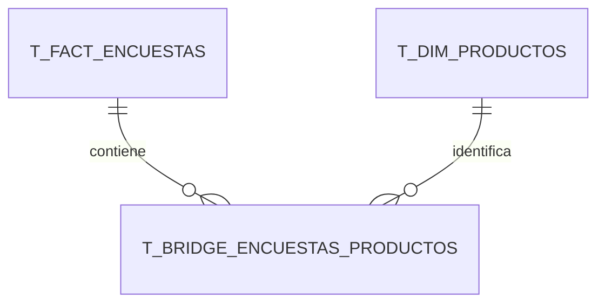

# Día 7 · Del Data Warehouse al cuadro de mando en Power BI

> Guion de apoyo para una clase de cuatro horas.
>
> Trabajaremos con `modelo-bi-encuestas-powerbi.xlsx`, que contiene 50.000
> encuestas ya limpiadas y transformadas. Hoy no toca corregir el Excel ni repetir
> la ETL: toca cargar el resultado de la ETL, construir el modelo semántico y
> convertir datos en información útil.

---

# La idea que debe quedar hoy

```text
EXCEL LIMPIO CON ESTRUCTURA DE DWH
                ↓
       MODELO SEMÁNTICO
                ↓
     MEDIDAS Y REGLAS DAX
                ↓
       VISUALES INTERACTIVOS
                ↓
          DECISIONES
```

Power BI no es simplemente una herramienta para dibujar gráficos.

Antes de crear un gráfico debemos:

1. Cargar únicamente las tablas que forman el modelo.
2. Asignar correctamente los tipos de datos.
3. Construir las relaciones.
4. Comprobar el sentido de propagación de los filtros.
5. Crear medidas que expresen reglas de negocio.
6. Diseñar cada página para responder preguntas concretas.

La frase para repetir durante la clase:

> Un gráfico bonito con un modelo incorrecto produce una respuesta incorrecta más
> rápidamente.

---

# Resultado que deberían llevarse

Al terminar la sesión cada alumna debería tener un fichero `.pbix` con:

- Las nueve tablas del modelo.
- Ocho relaciones verificadas.
- Una tabla exclusiva para medidas.
- Varias medidas DAX reutilizables.
- Cuatro páginas de informe:
  - **El pulso del call center**.
  - **Productos en el diván**.
  - **La liga de operadores**.
  - **CSI: calidad del dato**.
- Segmentadores sincronizados.
- Navegación entre páginas.
- Al menos un *drillthrough* o una página de *tooltip* como ejercicio opcional.

---

# Plan de las cuatro horas

| Tiempo | Bloque | Resultado |
|---|---|---|
| 00:00–00:15 | Abrir el caso y recorrer el Excel | Recordar el modelo creado ayer |
| 00:15–00:40 | Importar las nueve tablas | Datos cargados sin duplicidades |
| 00:40–01:20 | Construir y comprobar relaciones | Modelo semántico operativo |
| 01:20–01:35 | Tipos, ordenación y campos ocultos | Modelo cómodo para el informe |
| 01:35–01:50 | Descanso | |
| 01:50–02:25 | Crear medidas DAX | Capa de indicadores reutilizables |
| 02:25–03:00 | Página 1: El pulso del call center | Cuadro ejecutivo y temporal |
| 03:00–03:25 | Página 2: Productos en el diván | Uso correcto de la tabla puente |
| 03:25–03:45 | Páginas 3 y 4 | Operadores y calidad de datos |
| 03:45–04:00 | Interacción, reto y cierre | Navegación, filtros y conclusiones |

Si el grupo necesita más tiempo, se puede dejar la página de *tooltip* como tarea.
No conviene recortar la explicación de relaciones ni el ejemplo de la tabla puente.

---

# 1. Antes de abrir Power BI

## Ficheros necesarios

- `modelo-bi-encuestas-powerbi.xlsx`
- Power BI Desktop.

El Excel contiene doce hojas, pero solamente nueve son tablas del modelo.

## Las nueve tablas que cargaremos

| Tabla | Grano | Filas esperadas |
|---|---|---:|
| `T_FACT_ENCUESTAS` | Una fila por encuesta | 50.000 |
| `T_BRIDGE_ENCUESTAS_PRODUCTOS` | Un producto asociado a una encuesta | 94.818 |
| `T_DIM_PRODUCTOS` | Un producto del ERP | 14 |
| `T_DIM_CLIENTE` | Un cliente de la muestra | 50.000 |
| `T_DIM_TIPO_INCIDENCIA` | Un tipo de incidencia | 6 |
| `T_DIM_GENERO` | Un género normalizado | 4 |
| `T_DIM_COMUNIDAD` | Una comunidad o desconocida | 18 |
| `T_DIM_FECHA` | Un día entre 2024 y 2033 | 3.653 |
| `T_DIM_OPERADOR` | Un operador o entrevistador | 30 |

## Hojas que no cargaremos

- `00_LEEME`
- `10_REGLAS_ETL`
- `11_MEDIDAS_DAX`

Son documentación para nosotros, no tablas del modelo.

> **ERROR MUY HABITUAL:** En el navegador de Power BI pueden aparecer tanto las
> hojas de Excel como las tablas que contienen. Si seleccionamos una hoja y también
> su tabla, cargaremos dos veces los mismos datos y parecerá que las dimensiones
> están duplicadas.

Seleccionaremos solamente los objetos cuyos nombres empiecen por `T_`.

---

# 2. Importar el Excel

## Paso a paso

1. Abrir Power BI Desktop.
2. Seleccionar **Inicio > Obtener datos > Excel**.
3. Buscar `modelo-bi-encuestas-powerbi.xlsx`.
4. Esperar a que aparezca el navegador.
5. Marcar solamente las nueve tablas cuyos nombres comienzan por `T_`.
6. No marcar las hojas `00_LEEME`, `10_REGLAS_ETL` ni `11_MEDIDAS_DAX`.
7. Seleccionar **Transformar datos**, no **Cargar** todavía.

Elegimos **Transformar datos** para inspeccionar los tipos antes de incorporarlos
al modelo. Los datos ya vienen limpios; no pretendemos repetir la ETL dentro de
Power Query.

## Comprobación rápida en Power Query

En el panel izquierdo deben aparecer exactamente nueve consultas.

### `T_FACT_ENCUESTAS`

| Columnas | Tipo esperado |
|---|---|
| IDs y contadores | Número entero |
| `fecha_encuesta` | Fecha |
| `hora_encuesta` | Hora |
| `duracion_encuesta_seg` | Número entero |
| `satisfaccion_1_10` | Número entero |
| `importe_ultima_factura` | Número decimal fijo o decimal |
| `recomendaria` | Verdadero/falso |
| `movil`, `fibra`, `tv`, `otro` | Verdadero/falso |
| `errores` | Texto |
| `fecha_carga` | Fecha/hora |

### Resto de tablas

- Los IDs deben ser números enteros.
- Los nombres, DNI y códigos corporativos deben ser texto.
- `fecha_nacimiento_cliente` debe ser fecha.
- `T_DIM_FECHA[fecha]` debe ser fecha.
- `bisiesto`, `fin_de_semana` y `festivo` deben ser verdadero/falso.

## Si algún tipo no es correcto

1. Seleccionar la columna.
2. Usar el icono de tipo situado en la cabecera.
3. Elegir el tipo correcto.
4. Si Power BI pregunta si se sustituye el paso actual o se crea uno nuevo, crear
   un paso nuevo para que quede registrada la transformación.

Cuando todo esté correcto:

1. Seleccionar **Inicio > Cerrar y aplicar**.
2. Esperar a que termine la carga.
3. Guardar el proyecto como `encuestas-dia7.pbix`.

---

# 3. Comprobar el modelo antes de dibujar

Abrir la vista **Modelo** desde la barra izquierda.

Power BI puede intentar detectar relaciones automáticamente. No debemos aceptar
que una relación sea correcta solamente porque se haya creado sola.

## Limpieza de relaciones automáticas

Eliminar cualquier relación que:

- Una dimensiones entre sí por `id_bbdd_origen`.
- Una columnas simplemente porque tienen un nombre parecido.
- No aparezca en la lista que sigue.

`id_bbdd_origen` es un dato de trazabilidad; no es la clave que relaciona todas las
dimensiones.

## Las ocho relaciones correctas

| Tabla lado 1 | Clave | Tabla lado muchos | Clave | Filtro |
|---|---|---|---|---|
| `T_DIM_CLIENTE` | `id_cliente` | `T_FACT_ENCUESTAS` | `id_cliente` | Única dirección |
| `T_DIM_TIPO_INCIDENCIA` | `id_tipo_incidencia` | `T_FACT_ENCUESTAS` | `id_tipo_primera_incidencia` | Única dirección |
| `T_DIM_GENERO` | `id_genero` | `T_FACT_ENCUESTAS` | `id_genero` | Única dirección |
| `T_DIM_COMUNIDAD` | `id_comunidad` | `T_FACT_ENCUESTAS` | `comunidad_id` | Única dirección |
| `T_DIM_FECHA` | `fecha` | `T_FACT_ENCUESTAS` | `fecha_encuesta` | Única dirección |
| `T_DIM_OPERADOR` | `id_operador` | `T_FACT_ENCUESTAS` | `id_operador` | Única dirección |
| `T_FACT_ENCUESTAS` | `id_encuesta` | `T_BRIDGE_ENCUESTAS_PRODUCTOS` | `id_encuesta` | Ambas direcciones |
| `T_DIM_PRODUCTOS` | `id_producto` | `T_BRIDGE_ENCUESTAS_PRODUCTOS` | `id_producto` | Única dirección |

Todas deben estar activas.

## Crear una relación manualmente

Opción rápida:

1. Arrastrar la clave del lado 1 sobre la clave correspondiente del lado muchos.
2. Abrir la relación creada.
3. Comprobar cardinalidad `Uno a varios (1:*)`.
4. Comprobar la dirección del filtro.
5. Marcarla como activa.

Opción mediante menú:

1. Seleccionar **Modelado > Administrar relaciones**.
2. Pulsar **Nueva**.
3. Elegir las dos tablas y sus columnas.
4. Configurar cardinalidad y dirección.
5. Confirmar.

## La relación especial de la tabla puente



La tabla puente tiene muchas filas por encuesta y muchas filas por producto.

La relación entre `T_FACT_ENCUESTAS` y la tabla puente se configura con filtro en
ambas direcciones para que, al seleccionar un producto, el filtro llegue desde
`T_DIM_PRODUCTOS` hasta las encuestas.

Hay que explicarlo despacio:

```text
Selecciono TV PREMIUM
        ↓
DIM_PRODUCTOS filtra BRIDGE
        ↓
BRIDGE filtra FACT_ENCUESTAS
        ↓
Veo satisfacción, duración y facturación
de las encuestas cuyos clientes tenían TV PREMIUM
```

## Prueba de humo del modelo

Crear temporalmente una tabla visual con:

- `T_DIM_PRODUCTOS[nombre_producto]`
- Recuento distinto de `T_BRIDGE_ENCUESTAS_PRODUCTOS[id_encuesta]`

Si aparecen productos y cantidades, la dimensión filtra el puente.

Añadir después la satisfacción de `T_FACT_ENCUESTAS`. Si no cambia al seleccionar
productos, revisar la dirección de filtro entre el hecho y el puente.

---

# 4. Preparar el modelo para que resulte cómodo

## Marcar la tabla de fechas

1. En la vista Modelo, seleccionar `T_DIM_FECHA`.
2. Botón derecho sobre la tabla.
3. Seleccionar **Marcar como tabla de fechas** o **Configuración de tabla de
   fechas**, según la versión.
4. Activar la opción.
5. Elegir la columna `fecha`.

Power BI comprobará que la columna no contiene duplicados, huecos ni valores
nulos.

## Ordenar meses y días correctamente

Sin este paso, los meses aparecerán alfabéticamente.

1. Seleccionar `T_DIM_FECHA[mes_nombre]`.
2. Abrir **Herramientas de columna > Ordenar por columna**.
3. Elegir `mes_num`.
4. Seleccionar `T_DIM_FECHA[dia_semana]`.
5. Ordenarla por `dia_semana_num`.

## Evitar que Power BI sume identificadores

Para las columnas `id_*`:

1. Seleccionar la columna.
2. En **Herramientas de columna**, buscar **Resumen predeterminado**.
3. Elegir **No resumir**.

Un `id_cliente` no es una cantidad que tenga sentido sumar.

## Ocultar campos técnicos

Ocultar de la vista de informe, pero no borrar:

- Claves utilizadas únicamente para relaciones.
- `id_bbdd_origen` e IDs locales de las dimensiones.
- `id_lote_carga` y `fecha_carga`, salvo en la página de calidad.
- `fecha_sk`, si trabajaremos con la columna `fecha`.

Botón derecho sobre el campo > **Ocultar en la vista de informe**.

Los campos ocultos siguen funcionando en las relaciones.

## Crear dos columnas calculadas útiles

Seleccionar `T_FACT_ENCUESTAS` y pulsar **Modelado > Nueva columna**.

### Nombre legible del origen

```DAX
Origen encuesta =
SWITCH(
    T_FACT_ENCUESTAS[id_origen_encuesta],
    1, "Telefónica",
    2, "Manual",
    "Desconocida"
)
```

### Franja horaria

```DAX
Franja horaria =
VAR Hora = HOUR(T_FACT_ENCUESTAS[hora_encuesta])
RETURN
    SWITCH(
        TRUE(),
        Hora < 12, "Mañana",
        Hora < 16, "Mediodía",
        Hora < 20, "Tarde",
        "Noche"
    )
```

Aquí podemos detenernos para distinguir:

- **Columna calculada:** produce un valor para cada fila y se almacena en el
  modelo.
- **Medida:** produce un resultado según los filtros activos del informe.

---

# 5. Crear una tabla exclusiva para medidas

Es una tabla organizativa. No procede del Data Warehouse.

1. Seleccionar **Inicio > Introducir datos**.
2. Crear una columna llamada `Marcador`.
3. Escribir un único valor, por ejemplo `1`.
4. Llamar a la tabla `00_MEDIDAS`.
5. Pulsar **Cargar**.
6. Ocultar la columna `Marcador`.

Para crear cada medida:

1. Seleccionar la tabla `00_MEDIDAS`.
2. Pulsar **Modelado > Nueva medida**.
3. Pegar la expresión DAX.
4. Pulsar Intro.
5. Configurar el formato: entero, decimal, porcentaje o moneda.

Las medidas aparecen con un icono de calculadora.

---

# 6. Medidas DAX de la clase

## Medidas básicas

```DAX
Encuestas =
COUNTROWS(T_FACT_ENCUESTAS)
```

```DAX
Clientes encuestados =
DISTINCTCOUNT(T_FACT_ENCUESTAS[id_cliente])
```

En nuestra muestra ambas devuelven 50.000, pero no podemos suponer que siempre será
así. En otro proyecto un cliente podría contestar varias encuestas.

```DAX
% recomienda =
DIVIDE(
    CALCULATE(
        [Encuestas],
        T_FACT_ENCUESTAS[recomendaria] = TRUE()
    ),
    CALCULATE(
        [Encuestas],
        NOT ISBLANK(T_FACT_ENCUESTAS[recomendaria])
    )
)
```

Formatear como porcentaje con una cifra decimal.

```DAX
Satisfacción mediana =
MEDIAN(T_FACT_ENCUESTAS[satisfaccion_1_10])
```

```DAX
% satisfechos 8-10 =
DIVIDE(
    CALCULATE(
        [Encuestas],
        T_FACT_ENCUESTAS[satisfaccion_1_10] >= 8
    ),
    CALCULATE(
        [Encuestas],
        NOT ISBLANK(T_FACT_ENCUESTAS[satisfaccion_1_10])
    )
)
```

```DAX
Duración media (min) =
DIVIDE(
    AVERAGE(T_FACT_ENCUESTAS[duracion_encuesta_seg]),
    60
)
```

```DAX
Importe medio factura =
AVERAGE(T_FACT_ENCUESTAS[importe_ultima_factura])
```

Formatear como moneda.

## Medidas de familias pivotadas

```DAX
% con móvil =
DIVIDE(
    CALCULATE([Encuestas], T_FACT_ENCUESTAS[movil] = TRUE()),
    [Encuestas]
)
```

```DAX
% con fibra =
DIVIDE(
    CALCULATE([Encuestas], T_FACT_ENCUESTAS[fibra] = TRUE()),
    [Encuestas]
)
```

```DAX
% con TV =
DIVIDE(
    CALCULATE([Encuestas], T_FACT_ENCUESTAS[tv] = TRUE()),
    [Encuestas]
)
```

```DAX
% otro =
DIVIDE(
    CALCULATE([Encuestas], T_FACT_ENCUESTAS[otro] = TRUE()),
    [Encuestas]
)
```

## Medidas para la tabla puente

```DAX
Encuestas por producto =
DISTINCTCOUNT(T_BRIDGE_ENCUESTAS_PRODUCTOS[id_encuesta])
```

No utilizar simplemente el número de filas del puente para contar encuestas por
varias dimensiones. Una encuesta con tres productos aparece tres veces en el
puente.

```DAX
Relaciones producto =
COUNTROWS(T_BRIDGE_ENCUESTAS_PRODUCTOS)
```

```DAX
Productos medios =
DIVIDE(
    [Relaciones producto],
    [Encuestas]
)
```

El resultado general esperado es aproximadamente `1,90`.

```DAX
Encuestas multiproducto =
COUNTROWS(
    FILTER(
        ADDCOLUMNS(
            VALUES(T_BRIDGE_ENCUESTAS_PRODUCTOS[id_encuesta]),
            "NumeroProductos",
                CALCULATE(COUNTROWS(T_BRIDGE_ENCUESTAS_PRODUCTOS))
        ),
        [NumeroProductos] > 1
    )
)
```

El resultado esperado sin filtros es `34.227`.

## Medidas de calidad

```DAX
Encuestas con errores =
CALCULATE(
    [Encuestas],
    NOT ISBLANK(T_FACT_ENCUESTAS[errores])
)
```

```DAX
% encuestas con errores =
DIVIDE(
    [Encuestas con errores],
    [Encuestas]
)
```

Resultados de control:

| Control | Resultado esperado |
|---|---:|
| Encuestas | 50.000 |
| Encuestas telefónicas | 35.000 |
| Encuestas manuales | 15.000 |
| Relaciones encuesta-producto | 94.818 |
| Encuestas multiproducto | 34.227 |
| Encuestas con algún error | 973 |
| Error de producto `MÓVIL 100 G` | 871 |
| Errores de comunidad | 62 |
| Errores de género | 47 |

Los últimos tres recuentos pueden solaparse: una misma encuesta puede contener más
de un error.

---

# 7. Diseño común de las páginas

Antes de crear los gráficos, preparar una estructura común:

1. Cambiar el formato de página a `16:9`.
2. Añadir un título arriba.
3. Reservar una fila superior para tarjetas KPI.
4. Colocar los segmentadores en la izquierda o en una banda superior.
5. Usar el mismo color para el mismo concepto en todas las páginas.
6. Evitar más de seis o siete visuales principales por página.
7. Dejar espacios en blanco: también forman parte del diseño.

## Paleta sugerida

| Uso | Color aproximado |
|---|---|
| Fondo | Gris muy claro |
| Títulos | Azul oscuro |
| Resultado positivo | Verde |
| Atención | Naranja |
| Error | Rojo |
| Datos desconocidos | Gris |

## Segmentadores comunes

- Año.
- Mes.
- Comunidad.
- Origen de encuesta.

Después podremos usar **Vista > Sincronizar segmentadores** para que los mismos
filtros se apliquen en varias páginas.

---

# 8. Página 1 · El pulso del call center

## Pregunta de negocio

> ¿Cómo está funcionando globalmente el servicio y cómo evoluciona?

## Elementos

### Fila superior: cuatro tarjetas

1. `[Encuestas]`
2. `[% recomienda]`
3. `[% satisfechos 8-10]`
4. `[Duración media (min)]`

Para cada tarjeta:

1. Insertar un visual de tarjeta.
2. Arrastrar la medida.
3. Activar título.
4. Usar un título corto.
5. Ajustar el número de decimales.

### Evolución temporal

Gráfico de líneas:

- Eje X: `T_DIM_FECHA[anio_mes]`.
- Valores: `[Encuestas]`.
- Información sobre herramientas: `[% recomienda]`, `[% satisfechos 8-10]` y
  `[Duración media (min)]`.

### Mapa territorial sin mapa

Gráfico de barras horizontal:

- Eje: `T_DIM_COMUNIDAD[nombre_comunidad]`.
- Valor: `[% satisfechos 8-10]`.
- Información sobre herramientas: `[Encuestas]` y `[% recomienda]`.
- Orden descendente por satisfacción.

No usamos necesariamente un mapa geográfico: las barras permiten comparar mejor
pequeñas diferencias.

### ¿Quién responde?

Gráfico de anillos:

- Leyenda: `T_DIM_GENERO[nombre_genero]`.
- Valores: `[Encuestas]`.

Pregunta para el grupo:

> ¿Un gráfico circular aporta algo aquí que no aportaría una barra?

---

# 9. Página 2 · Productos en el diván

## Pregunta de negocio

> ¿Qué productos tenían contratados las personas encuestadas y cómo cambia la
> satisfacción según el producto?

Esta página demuestra por qué construimos una tabla puente.

## Tarjetas superiores

- `[% con móvil]`
- `[% con fibra]`
- `[% con TV]`
- `[Productos medios]`

## Ranking de productos concretos

Gráfico de barras:

- Eje: `T_DIM_PRODUCTOS[nombre_producto]`.
- Valor: `[Encuestas por producto]`.
- Orden descendente.

Añadir como *tooltip*:

- `[% satisfechos 8-10]`
- `[% recomienda]`
- `[Importe medio factura]`

## Dispersión: precio frente a satisfacción

Gráfico de dispersión:

- Eje X: `[Importe medio factura]`.
- Eje Y: `[% satisfechos 8-10]`.
- Tamaño: `[Encuestas por producto]`.
- Detalles: `T_DIM_PRODUCTOS[nombre_producto]`.

Preguntas:

- ¿Los productos más caros tienen clientes más satisfechos?
- ¿Hay algún producto con poca muestra que parezca extraordinario?
- ¿Estamos viendo causalidad o solamente asociación?

## Árbol de descomposición

Si está disponible en la versión instalada:

- Analizar: `[% satisfechos 8-10]`.
- Explicar por:
  - Producto.
  - Comunidad.
  - Operador.
  - Origen de encuesta.
  - Franja horaria.

Nombre divertido del visual: **¿Quién se ha comido la satisfacción?**

## Prueba del puente

Seleccionar `TV PREMIUM` en el gráfico de productos.

Deberían cambiar:

- Las tarjetas de satisfacción.
- El importe medio.
- La distribución territorial.

Si solamente cambia el gráfico de productos, la relación del puente no está
propagando el filtro hasta el hecho.

---

# 10. Página 3 · La liga de operadores

## Pregunta de negocio

> ¿Qué operadores combinan buen servicio, tiempos razonables y una muestra
> suficiente?

No debemos premiar a alguien por tener una satisfacción de 10 si solamente ha
realizado dos encuestas.

## Tabla de clasificación

Matriz o tabla con:

- `T_DIM_OPERADOR[nombre_operador]`
- `T_DIM_OPERADOR[equipo]`
- `[Encuestas]`
- `[% satisfechos 8-10]`
- `[% recomienda]`
- `[Duración media (min)]`

Aplicar formato condicional:

- Escala verde para satisfacción.
- Escala naranja o roja para duración.
- Barra de datos para número de encuestas.

## Gráfico de dispersión

- Eje X: `[Duración media (min)]`.
- Eje Y: `[% satisfechos 8-10]`.
- Tamaño: `[Encuestas]`.
- Detalles: `T_DIM_OPERADOR[nombre_operador]`.
- Leyenda: `T_DIM_OPERADOR[equipo]`.

Dividir mentalmente el gráfico en cuatro cuadrantes:

| Cuadrante | Interpretación |
|---|---|
| Rápido + satisfecho | Referencia a estudiar |
| Lento + satisfecho | Quizás resuelve casos complejos |
| Rápido + insatisfecho | Posible atención precipitada |
| Lento + insatisfecho | Requiere investigación |

No convertir automáticamente una correlación en una evaluación del trabajador.
Puede haber diferencias en los casos atendidos.

## Reto rápido

> Encontrad un operador que parezca excelente. Después añadid un filtro de mínimo
> 500 encuestas. ¿Sigue pareciendo excelente?

---

# 11. Página 4 · CSI: calidad del dato

## Pregunta de control

> ¿Qué ha ocurrido durante la ETL y qué datos necesitan revisión?

## Tarjetas

- `[Encuestas con errores]`
- `[% encuestas con errores]`
- `[% otro]`
- `[Encuestas]`

## Origen de los problemas

Gráfico de columnas:

- Eje: `T_FACT_ENCUESTAS[Origen encuesta]`.
- Valor: `[Encuestas con errores]`.

Los errores de texto deberían concentrarse en las encuestas manuales.

## Tabla de investigación

Añadir:

- `id_encuesta`
- `Origen encuesta`
- `id_encuesta_origen`
- `fecha_encuesta`
- `errores`
- `id_lote_carga`
- `fecha_carga`

En el panel de filtros del visual:

- Configurar `errores` como **no está en blanco**.

## El caso `MÓVIL 100 G`

Filtrar `errores` por:

```text
PRODUCTO_NO_ENCONTRADO: MÓVIL 100 G
```

Resultado esperado: 871 encuestas.

Explicación:

- El producto existe en el nuevo ERP.
- La tabla puente conserva el producto concreto.
- La regla de agrupación todavía no sabe si pertenece a MÓVIL, FIBRA o TV.
- La ETL activa `otro`.
- La ETL deja constancia del error.
- Cuando se actualice la regla, esas filas podrán reprocesarse.

La ETL no ha fallado y tampoco ha escondido el problema.

## Un botón para salir del modo desastre

1. Insertar un botón **Borrar todos los segmentadores** si está disponible.
2. Alternativamente, crear un marcador sin filtros.
3. Insertar un botón y asignarle la acción del marcador.
4. Etiquetarlo como **Salir del modo desastre**.

---

# 12. Interacciones entre visuales

Seleccionar un visual y usar **Formato > Editar interacciones**.

Para cada visual de la página podemos decidir si el seleccionado:

- Lo filtra.
- Lo resalta.
- No le afecta.

Ejercicio:

1. Seleccionar una comunidad.
2. Observar cómo cambian las tarjetas y los demás gráficos.
3. Desactivar la interacción con un visual.
4. Explicar por qué a veces interesa mantener una referencia global.

---

# 13. Navegación entre páginas

Opción sencilla:

1. Seleccionar **Insertar > Botones > Navegador > Navegador de páginas**.
2. Colocarlo en la cabecera o en el lateral.
3. Ajustar colores de estado normal, seleccionado y al pasar el ratón.

El navegador se actualiza automáticamente cuando se añaden o renombran páginas.

En Power BI Desktop puede ser necesario usar `Ctrl + clic` para activar un botón
mientras estamos editando.

---

# 14. Ejercicio opcional de drillthrough

Crear una página llamada **Ficha del operador**.

1. Añadir `T_DIM_OPERADOR[nombre_operador]` al área de filtros de *drillthrough*.
2. Añadir tarjetas con encuestas, satisfacción, recomendación y duración.
3. Añadir una línea temporal.
4. Mantener el botón Atrás que Power BI crea automáticamente.
5. Ocultar la página para que se abra solamente mediante *drillthrough*.

Desde **La liga de operadores**:

1. Botón derecho sobre un operador.
2. Elegir **Drillthrough > Ficha del operador**.

La página se abre filtrada para ese operador.

---

# 15. Ejercicio opcional de tooltip personalizado

Crear una página llamada **Tooltip producto**.

1. Añadir una página nueva.
2. En formato de página, elegir tamaño `Tooltip`.
3. Activar **Información de página > Tooltip**.
4. Añadir el campo `nombre_producto` al área de campos de tooltip.
5. Crear tres tarjetas pequeñas:
   - Encuestas por producto.
   - % satisfechos.
   - Importe medio.
6. En el gráfico de productos, configurar esta página como tooltip.

Al pasar el ratón por un producto aparecerá una mini ficha contextual.

---

# 16. Preguntas para convertir gráficos en conversación

## Nivel operacional

- ¿Qué operadores presentan duraciones anormalmente altas?
- ¿En qué franja horaria cae la satisfacción?
- ¿Qué errores de ETL necesitan revisión hoy?

## Nivel táctico

- ¿Qué productos concentran más insatisfacción?
- ¿Hay comunidades con evolución negativa durante varios meses?
- ¿Las encuestas manuales y telefónicas producen resultados comparables?

## Nivel estratégico

- ¿Qué familias de producto parecen asociadas a mayor recomendación?
- ¿Existe una tendencia general de mejora o deterioro?
- ¿La calidad del dato permite tomar estas decisiones con confianza?

---

# 17. Retos divertidos para el final

## Reto 1 · El operador misterioso

Encontrar el operador que combina:

- Al menos 500 encuestas.
- Satisfacción por encima de la media del grupo.
- Duración por debajo de la media.

## Reto 2 · El producto incomprendido

Encontrar un producto que:

- Tenga una satisfacción aparentemente baja.
- Pero una muestra relativamente pequeña.

Debatir si tomaríamos una decisión comercial sólo con ese gráfico.

## Reto 3 · La encuesta imposible

Localizar encuestas con:

- Duraciones extremadamente cortas o largas.
- Satisfacción alta pese a muchas incidencias.
- Errores en más de una columna.

## Reto 4 · Cazadores de duplicidades

Comparar:

```text
COUNTROWS(T_BRIDGE_ENCUESTAS_PRODUCTOS)
```

con:

```text
DISTINCTCOUNT(T_BRIDGE_ENCUESTAS_PRODUCTOS[id_encuesta])
```

Explicar por qué son distintos y cuál utilizaríamos para contar encuestas.

## Reto 5 · Dos encuestas con el mismo ID

Filtrar `id_encuesta_origen = 25`.

Deberían existir dos hechos:

- Origen 1, encuesta local 25.
- Origen 2, encuesta local 25.

No son duplicados porque su origen es distinto.

---

# 18. Errores habituales durante la clase

## «Me aparecen las tablas duplicadas»

Se han seleccionado la hoja de Excel y su tabla. Volver a Power Query y conservar
solamente las consultas que empiezan por `T_`.

## «Power BI quiere sumar los IDs»

Cambiar el resumen predeterminado a **No resumir**.

## «Los meses aparecen en orden alfabético»

Ordenar `mes_nombre` por `mes_num`.

## «Selecciono un producto y no cambia la satisfacción»

Revisar la dirección de filtro entre `T_FACT_ENCUESTAS` y
`T_BRIDGE_ENCUESTAS_PRODUCTOS`.

## «El total de encuestas aumenta al usar productos»

Se están contando filas de la tabla puente. Utilizar
`DISTINCTCOUNT(id_encuesta)` o la medida `[Encuestas por producto]`.

## «La medida DAX da error con las comas»

Dependiendo de la configuración regional, sustituir las comas por punto y coma.

## «Una tarjeta no cambia con un filtro»

Comprobar:

- Relaciones activas.
- Dirección del filtro.
- Interacciones entre visuales.
- Que la medida utiliza la tabla adecuada.

## «Desconocido y en blanco parecen lo mismo»

No son necesariamente lo mismo:

- El ID `0` representa un valor desconocido tratado por la ETL.
- Un blanco puede significar que la pregunta no se contestó o que la medida lo
  excluye deliberadamente.

---

# 19. Lista de comprobación antes de terminar

## Modelo

- [ ] Hay exactamente nueve tablas procedentes del Excel.
- [ ] No se han cargado hojas y tablas duplicadas.
- [ ] Existen ocho relaciones activas.
- [ ] La relación hecho-puente filtra en ambas direcciones.
- [ ] La tabla Fecha está marcada como tabla de fechas.
- [ ] Mes y día de la semana están ordenados correctamente.
- [ ] Los identificadores no se resumen.
- [ ] Las claves técnicas innecesarias están ocultas.

## Medidas

- [ ] Encuestas = 50.000.
- [ ] Relaciones producto = 94.818.
- [ ] Productos medios ≈ 1,90.
- [ ] Encuestas multiproducto = 34.227.
- [ ] Encuestas con errores = 973.
- [ ] Los porcentajes tienen formato de porcentaje.
- [ ] El importe tiene formato monetario.

## Informe

- [ ] Cada página responde una pregunta concreta.
- [ ] Los títulos explican el contenido.
- [ ] Los segmentadores son coherentes.
- [ ] Los colores tienen el mismo significado en todas las páginas.
- [ ] Los gráficos reaccionan correctamente a las selecciones.
- [ ] Hay navegación entre páginas.
- [ ] El fichero `.pbix` está guardado.

---

# 20. Cierre de la sesión

Reconstruir verbalmente el recorrido completo:

```text
DOS ORÍGENES DE ENCUESTAS
        ↓
ETL CON IDS, REGLAS Y CONTROL DE ERRORES
        ↓
DATA WAREHOUSE CON HECHO, DIMENSIONES Y PUENTE
        ↓
MODELO SEMÁNTICO EN POWER BI
        ↓
MEDIDAS DAX
        ↓
CUADROS DE MANDO
        ↓
PREGUNTAS Y DECISIONES
```

Las cinco ideas finales:

1. Power BI no corrige un modelo mal planteado.
2. Las relaciones determinan cómo se propagan los filtros.
3. Una medida no es una columna ni un cálculo fijo.
4. La tabla puente evita perder productos sin duplicar las encuestas.
5. Un buen cuadro de mando no enseña todos los datos: ayuda a responder preguntas.

---

# Referencias oficiales de apoyo

- Introducción a Power BI Desktop:
  https://learn.microsoft.com/en-us/power-bi/fundamentals/desktop-getting-started
- Relaciones en Power BI Desktop:
  https://learn.microsoft.com/en-us/power-bi/transform-model/desktop-create-and-manage-relationships
- Medidas DAX:
  https://learn.microsoft.com/en-us/power-bi/transform-model/desktop-measures
- Tablas de fechas:
  https://learn.microsoft.com/en-us/power-bi/transform-model/desktop-date-tables
- Ordenar una columna por otra:
  https://learn.microsoft.com/en-us/power-bi/create-reports/desktop-sort-by-column
- Drillthrough:
  https://learn.microsoft.com/en-us/power-bi/create-reports/desktop-drillthrough
- Tooltips de página:
  https://learn.microsoft.com/en-us/power-bi/create-reports/desktop-tooltips
- Navegadores y botones:
  https://learn.microsoft.com/en-us/power-bi/create-reports/button-navigators
